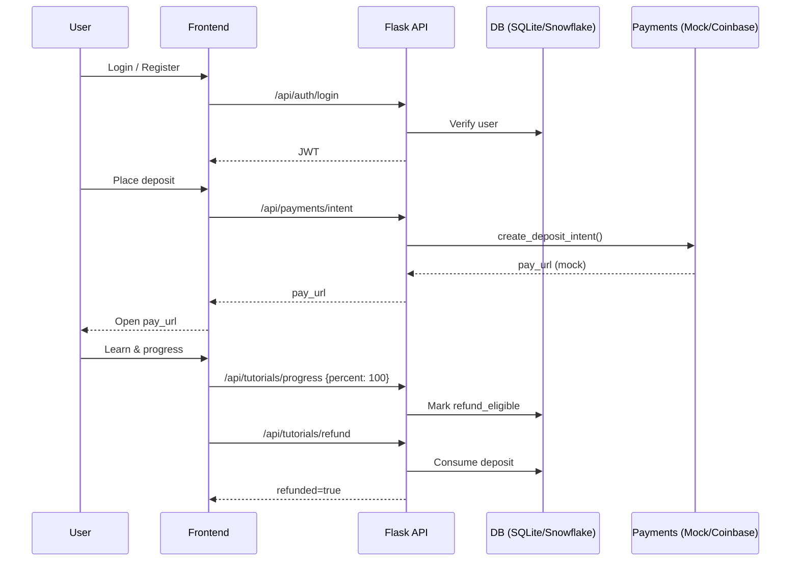

# 💻 NuSkill – Undergraduate Capstone Project

NuSkill is a platform for **interactive programming tutorials** backed by a refundable **cryptocurrency deposit** to motivate completion.

This repository is a *portfolio-ready vertical slice* that shows the core flows:
- **Auth** (register/login)
- **Deposit intent (mocked)** via a payments client abstraction
- **Tutorial progress** updates
- **Refund eligibility** on completion

> This is designed to run in **mock mode** locally (no real Coinbase or Snowflake secrets). See `SAFE_NOTES.md`.

---

## 🧭 How it works (high-level)


---

## 🚀 Run locally (mock mode)
```bash
cd backend
python -m venv .venv && source .venv/bin/activate   # Windows: .venv\Scripts\activate
pip install -r requirements.txt

# Create .env with mock settings
cp ../.env.example .env

# Initialize demo DB (SQLite)
export USE_SQLITE=1
python -c "from nuskill.models import init_demo_db; init_demo_db()"

# Start API
python app.py
```

Then visit `http://localhost:5000/health` to verify the server is up.

---

## 📂 Repo structure
```
NuSkill-Capstone/
  backend/        # Flask API (auth, payments mock, tutorials)
  frontend/       # Sample React components (illustrative)
  sql/            # schema + seed data
  docs/           # architecture notes + diagrams (Mermaid)
  SAFE_NOTES.md   # what was redacted + how to run safely
  .env.example
```

---

## 🛡️ Security & Privacy
- No secrets committed. Use `.env` with local values.
- Payments run in **mock mode** by default (no external network calls).
- DB uses SQLite for demos; Snowflake code path retained but disabled by default.

---

## 👀 What to review
- `backend/nuskill/payments.py` → **API wrapper with mock mode**
- `backend/nuskill/auth.py` → **secure auth flow (hashed passwords, JWT)**
- `backend/nuskill/tutorials.py` → **business logic for refund eligibility**
- `sql/schema.sql` → **minimal, clean schema**
- `docs/architecture.md` → **1-pager overview + sequence diagram**
